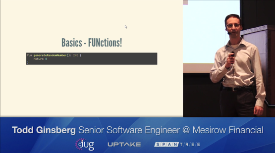

# A Brief Tour of Kotlin

This is lightning talk I gave at a Chicago Java Users Group meeting on December 13, 2016. This was my third time speaking in public, and while I was still nervous I felt better about this one than others. 

### Slide Show

This slides for this presentation can be [viewed here](https://tginsberg.github.io/brief-tour-of-kotlin).

### Video

The folks at [Spantree](http://www.spantree.net/) were nice enough to record and post a video of the presentation. Check it out below!

### Feedback

I included a link to a quick anonymous survey in order to collect feedback. Two people were kind enough to spend time filling it out and I got some great feedback. Things I have to work on: Pause more instead of "um" and "ah" (this is super hard), give an overview of WHY to use Kotlin not just assume it's self evident or that my audience has heard of it, and perhaps provide an agenda, kill the "Kotlin Island" joke (which did seem funnier at home).
